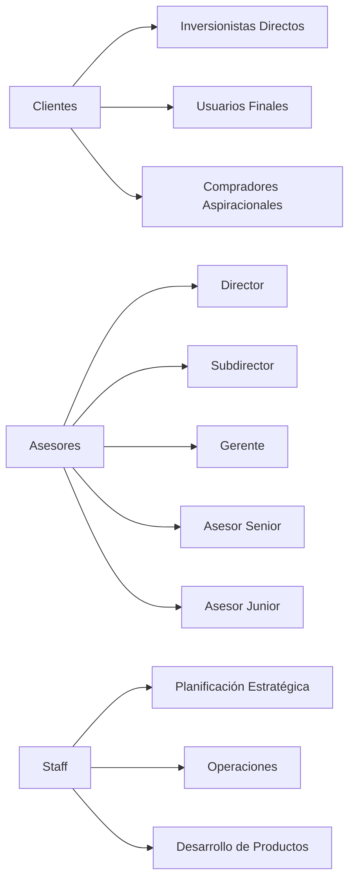

## Ecosistema de Usuarios

El diagrama de Venn ilustra la estructura fundamental de los usuarios en Grupo Colorines, mostrando cómo Staff, Asesores y Clientes interactúan en un ecosistema interconectado. Las áreas de intersección representan los puntos de colaboración y valor compartido.

<CardGroup cols={3}>
  <Card title="Intersección Staff y Asesores" icon="handshake">
    - Compartiendo estrategias y conocimientos
    - Coordinación para el desarrollo de negocios
    - Alineación de objetivos organizacionales
  </Card>
  <Card title="Intersección Staff y Clientes" icon="users-gear">
    - Soporte y servicios al cliente
    - Desarrollo de productos basados en necesidades
    - Gestión de experiencia del cliente
  </Card>
  <Card title="Intersección Asesores y Clientes" icon="user-tie">
    - Proceso de ventas y asesoramiento
    - Generación de confianza y valor
    - Transformación de prospectos en clientes
  </Card>
</CardGroup>

## Diagrama de Usuarios

## Impacto en Números

<CardGroup cols={2}>
  <Card title="16,000+" icon="chart-line">
    **Terrenos Vendidos**
    
    Cada terreno representa una historia de patrimonio construido y sueños realizados.
  </Card>
  <Card title="12,500+" icon="handshake">
    **Clientes Satisfechos**
    
    Una red sólida de relaciones cimentada en la confianza y transparencia.
  </Card>
</CardGroup>

## Tipos de Usuarios en Grupo Colorines

### 1. Clientes: Arquitectos de Patrimonio

<CardGroup cols={3}>
  <Card title="Inversionistas Estratégicos" icon="chart-line">
    **Características**
    - Visión de largo plazo
    - Sofisticación financiera
    - Búsqueda de oportunidades de valorización
    
    **Motivaciones**
    - Generación de patrimonio
    - Diversificación de inversiones
    - Aprovechamiento de tendencias regionales
  </Card>
  <Card title="Usuarios Finales" icon="house-user">
    **Características**
    - Proyecto personal como prioridad
    - Conexión emocional con el territorio
    - Búsqueda de espacios para materializar sueños
    
    **Motivaciones**
    - Construcción de un espacio propio
    - Proyecto de vida familiar
    - Conexión con la naturaleza y comunidad
  </Card>
  <Card title="Compradores Aspiracionales" icon="seedling">
    **Características**
    - En etapa inicial de planificación patrimonial
    - Alta motivación de crecimiento
    - Potencial de transformación
    
    **Motivaciones**
    - Movilidad social
    - Primera inversión significativa
    - Construcción de patrimonio familiar
  </Card>
</CardGroup>

### 2. Asesores: Facilitadores de Oportunidades

<Card title="Estructura Jerárquica" icon="sitemap">
  La estructura de asesores está diseñada para maximizar el desarrollo profesional y la efectividad comercial:
  
  - **Director**: Visión estratégica y liderazgo
  - **Subdirector**: Coordinación de equipos y estrategias
  - **Gerente**: Gestión de equipos y objetivos comerciales
  - **Asesor Senior**: Experiencia y desarrollo de talento
  - **Asesor Junior**: Potencial y crecimiento profesional
</Card>

<CardGroup cols={2}>
  <Card title="Características" icon="user-check">
    - Profundo conocimiento del mercado inmobiliario
    - Capacidad de generar valor más allá de la venta
    - Red de contactos especializada
    - Habilidades de asesoramiento financiero
  </Card>
  <Card title="Necesidades" icon="puzzle-piece">
    - Herramientas de inteligencia de negocio
    - Formación continua
    - Sistemas de seguimiento de prospectos
    - Métricas de desempeño claras
    - Soporte tecnológico para gestión comercial
  </Card>
</CardGroup>

### 3. Staff: Arquitectos Operativos

<Card title="Áreas de Especialización" icon="diagram-project">
  El equipo de staff representa la columna vertebral que sostiene y potencia el ecosistema Colorines:
  
  - **Planificación Estratégica**: Dirección y visión de futuro
  - **Operaciones**: Ejecución y optimización de procesos
  - **Desarrollo de Productos**: Innovación y creación de valor
  - **Marketing**: Posicionamiento y comunicación
  - **Innovación**: Transformación y mejora continua
</Card>

<CardGroup cols={2}>
  <Card title="Características" icon="gears">
    - Visión sistémica del negocio
    - Capacidad de innovación
    - Orientación a resultados
    - Compromiso con la transformación del modelo inmobiliario
  </Card>
  <Card title="Necesidades" icon="toolbox">
    - Herramientas de análisis estratégico
    - Sistemas de inteligencia de negocio
    - Capacidad de integración de datos
    - Flexibilidad operativa
    - Plataformas de colaboración y comunicación
  </Card>
</CardGroup>

## Ecosistema de Valor

<Card title="Un Hub Inmobiliario Integral" icon="network-wired">
  Grupo Colorines no es solo una inmobiliaria, sino un hub que:
  - Centraliza actores del mercado inmobiliario
  - Genera conexiones estratégicas
  - Crea valor más allá de la simple compraventa
</Card>

## Conclusión: Un Ecosistema Interconectado

Lo verdaderamente innovador de Grupo Colorines es cómo estos tres tipos de usuarios no operan de manera aislada, sino que se complementan y potencian mutuamente. Cada perfil aporta una dimensión única al ecosistema:

<CardGroup cols={3}>
  <Card title="Clientes" icon="users">
    Son el centro, con sus diversas motivaciones y proyectos
  </Card>
  <Card title="Asesores" icon="user-tie">
    Son los facilitadores, que traducen oportunidades en realidades
  </Card>
  <Card title="Staff" icon="building-user">
    Son los arquitectos que diseñan, sostienen y evolucionan constantemente el modelo
  </Card>
</CardGroup>

Esta visión holística transforma la experiencia inmobiliaria de una simple transacción a un viaje de desarrollo patrimonial y personal.
