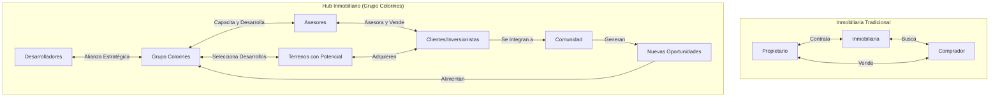
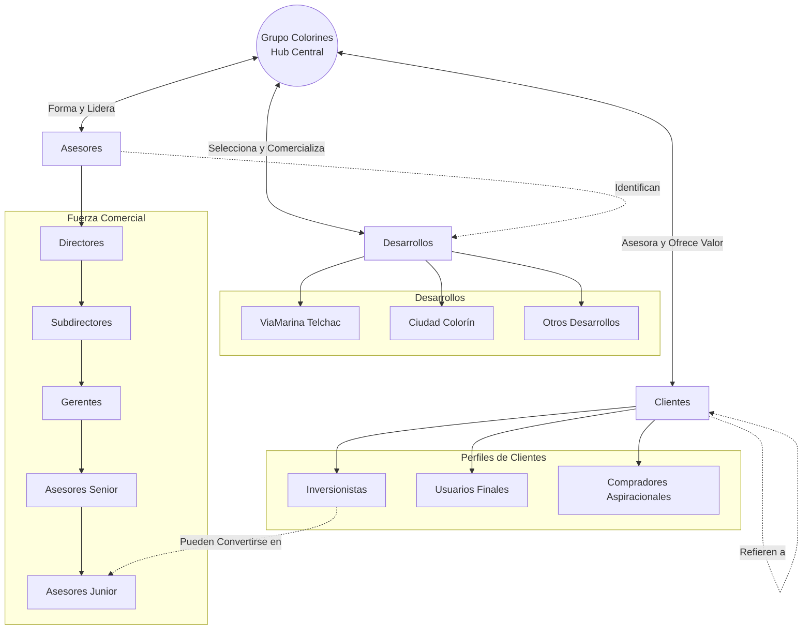

Grupo Colorines es un hub inmobiliario especializado en la comercialización de lotes y terrenos en la península de Yucatán, particularmente en los estados de Yucatán y Quintana Roo, México. Pero definirlo simplemente como una "inmobiliaria" sería reducir su verdadera naturaleza y alcance. 

## Concepto de Hub Inmobiliario

A diferencia de las agencias inmobiliarias tradicionales que funcionan principalmente como intermediarios en transacciones entre propietarios y compradores, un hub inmobiliario opera como un ecosistema integrado que centraliza múltiples elementos de la cadena de valor inmobiliaria.

### Inmobiliaria Tradicional vs Hub Inmobiliario

Grupo Colorines, como hub inmobiliario, se distingue por:

### Centralización de Ecosistemas Completos

En lugar de limitarse a conectar vendedores y compradores, Grupo Colorines integra a todos los actores relevantes en el proceso inmobiliario: desarrolladores de tierra, inversionistas, asesores inmobiliarios y compradores finales. Esta centralización crea un sistema interconectado donde el valor fluye en múltiples direcciones.

Un comprador no solo adquiere un terreno, sino que ingresa a un ecosistema donde puede conectarse con otros inversionistas, acceder a información privilegiada sobre desarrollos futuros, e incluso convertirse en asesor si así lo desea.

### El Ecosistema de Grupo Colorines

### Creación de Valor Agregado

Grupo Colorines va más allá de la simple intermediación comercial, generando valor en múltiples niveles:

- **Conocimiento del mercado**: Aprovecha más de 20 años de experiencia en el sector inmobiliario de la península para identificar oportunidades con verdadero potencial de plusvalía.
  
- **Formación de asesores**: No solo cuenta con una fuerza de ventas, sino que desarrolla profesionales inmobiliarios a través de capacitación continua.
  
- **Redes de oportunidad**: Construye conexiones entre diferentes actores del mercado que generan oportunidades de negocio más allá de la compraventa inicial.

### Facilitación de Conexiones Estratégicas

Como centro neurálgico del ecosistema inmobiliario, Grupo Colorines facilita conexiones que de otro modo serían difíciles de establecer:

- Vincula a inversionistas con capital disponible con desarrollos en etapas tempranas que ofrecen mayor potencial de rendimiento.
  
- Conecta a propietarios de tierra con desarrolladores que pueden maximizar el valor de sus propiedades.
  
- Une a asesores inmobiliarios con carteras de clientes específicas con desarrollos que se ajustan a las necesidades de esos clientes.

### Desarrollo de Comunidades

La visión de Grupo Colorines trasciende la venta de terrenos individuales para enfocarse en la creación de comunidades prósperas:

- Selecciona y comercializa desarrollos que contemplan infraestructura y amenidades para crear verdaderos núcleos de vida comunitaria.
  
- Promueve un enfoque de desarrollo sostenible que armoniza con el entorno natural de la península.
  
- Facilita la creación de redes sociales y comerciales entre los propietarios de sus desarrollos.

## Modelo Operativo

El funcionamiento de Grupo Colorines se basa en un modelo operativo distintivo:

### Estructura Piramidal de Ventas

La fuerza comercial se organiza en una estructura que permite:

- Escalabilidad a través del crecimiento orgánico de equipos de venta
- Desarrollo de liderazgo mediante un sistema de mentoreo en cascada
- Transferencia efectiva de conocimiento y mejores prácticas
- Sistema de incentivos que premia tanto el desempeño individual como el grupal

<Mermaid>
graph TD
    classDef directores fill:#E0338F,color:white;
    classDef subdirectores fill:#E65CA0,color:white;
    classDef gerentes fill:#EC85B1,color:white;
    classDef senior fill:#F1ADC2,color:black;
    classDef junior fill:#F7D6E0,color:black;
    
    D[Directores] --> SD1[Subdirector 1] & SD2[Subdirector 2]
    SD1 --> G1[Gerente 1.1] & G2[Gerente 1.2]
    SD2 --> G3[Gerente 2.1] & G4[Gerente 2.2]
    
    G1 --> AS1[Asesor Senior 1.1.1] & AS2[Asesor Senior 1.1.2]
    G2 --> AS3[Asesor Senior 1.2.1]
    G3 --> AS4[Asesor Senior 2.1.1]
    G4 --> AS5[Asesor Senior 2.2.1]
    
    AS1 --> AJ1[Asesor Junior] & AJ2[Asesor Junior]
    AS2 --> AJ3[Asesor Junior]
    AS3 --> AJ4[Asesor Junior] & AJ5[Asesor Junior]
    AS4 --> AJ6[Asesor Junior] & AJ7[Asesor Junior]
    AS5 --> AJ8[Asesor Junior]
    
    class D directores;
    class SD1,SD2 subdirectores;
    class G1,G2,G3,G4 gerentes;
    class AS1,AS2,AS3,AS4,AS5 senior;
    class AJ1,AJ2,AJ3,AJ4,AJ5,AJ6,AJ7,AJ8 junior;
</Mermaid>

Esta estructura ha permitido formar y desarrollar a más de 800 asesores inmobiliarios que conforman el motor comercial de la organización.

### Ciclo Comercial y Flujo de Valor

<Mermaid>
flowchart LR
    P[Prospección] --> C[Cotización]
    C --> V[Visita al Desarrollo]
    V --> N[Negociación]
    N --> CV[Cierre de Venta]
    CV --> S[Seguimiento]
    
    subgraph "Flujo de Comisiones"
        CV --> |Comisión Directa| AJ[Asesor que Vendió]
        CV --> |Override| AS[Asesor Senior]
        CV --> |Override| G[Gerente]
        CV --> |Override| SD[Subdirector]
        CV --> |Override| D[Director]
    end
    
    subgraph "Flujo de Valor para el Cliente"
        S --> |Plusvalía| R[Rendimiento]
        S --> |Oportunidades de Inversión| NI[Nuevas Inversiones]
        S --> |Integración a la Comunidad| RC[Redes y Contactos]
    end
</Mermaid>

### Selección Estratégica de Desarrollos

Grupo Colorines no comercializa cualquier propiedad, sino que selecciona cuidadosamente los desarrollos basándose en criterios como:

- Ubicación con potencial real de plusvalía
- Seguridad jurídica de la propiedad
- Accesibilidad y conectividad
- Atractivos naturales o urbanísticos
- Potencial para crear comunidades vibrantes

Esta selectividad asegura que los clientes adquieran terrenos con verdadero potencial de valorización, lo que ha construido la confianza que respalda los más de 12,500 clientes satisfechos.

### Plataforma Digital Integrada

La operación se sustenta en una plataforma tecnológica que permite:

- Gestión centralizada de inventarios de terrenos
- Seguimiento detallado del ciclo de ventas
- Administración transparente de comisiones
- Análisis de datos para la toma de decisiones estratégicas
- Comunicación fluida entre todos los elementos del ecosistema

## Propósito y Visión

La existencia de Grupo Colorines se fundamenta en un propósito claro:

**Forjar conexiones sólidas en el ámbito inmobiliario y generar transacciones de valor, aprovechando nuestro amplio conocimiento de la tierra.**

Este propósito se proyecta hacia una visión ambiciosa:

**Ser el referente líder en el sector inmobiliario, reconocidos por nuestra capacidad única para potenciar el crecimiento y la creación de patrimonio.**

Grupo Colorines no se ve a sí mismo simplemente como un comercializador de tierra, sino como un catalizador para la creación de valor compartido, donde los asesores, los clientes y los desarrolladores pueden prosperar simultáneamente en un ecosistema que beneficia a todos sus participantes.

A través de este enfoque integral, Grupo Colorines ha logrado un impacto significativo, con más de 16,000 terrenos vendidos, convirtiéndose en una fuerza transformadora en el desarrollo inmobiliario de la península de Yucatán.